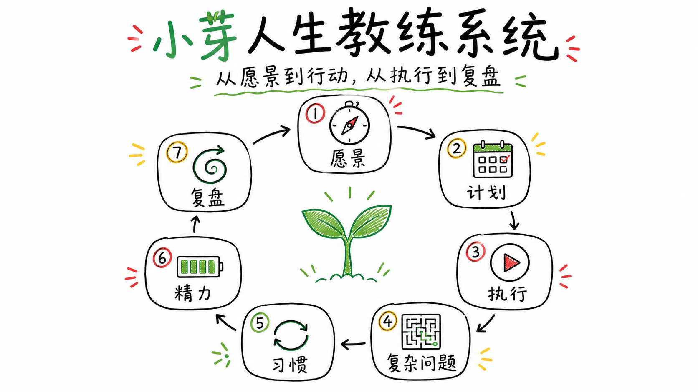

# Life Coach Codex Skills

Life Coach 是一套中文、公开安全、可长期维护的 Codex skills，用来把人生方向转化为具体计划、习惯、复盘和实验。

这个仓库是人生教练 agent 的公开版本。总调度人格和路由规则写在 `AGENTS.md`，可复用能力以独立 Codex skill 的形式放在 `skills/` 下。



## 结构

```text
life-coach/
├── AGENTS.md
├── README.md
├── references/
│   ├── coaching-process.md
│   └── memory-system.md
├── skills/
│   ├── life-vision/
│   ├── procrastination-execution/
│   ├── planning/
│   ├── review/
│   ├── habit-design/
│   ├── energy-management/
│   └── complex-problem-solving/
└── examples/
```

## Skills

- `life-vision`：澄清价值观、角色、长期方向、人生主题和人生实验。
- `procrastination-execution`：从卡住、逃避、过度思考进入可执行的下一步。
- `planning`：制定年度、月度、周、日或项目计划。
- `review`：复盘发生了什么，提炼学习，并决定下一轮调整。
- `habit-design`：设计适配真实情境的小习惯和替代行为。
- `energy-management`：围绕精力、恢复、节律和低容量状态做计划。
- `complex-problem-solving`：处理复杂问题，拆分事实、解释、假设、约束，设计小实验。

## 语言规范

本项目面向中文用户，所有公开 skill 内容默认使用中文。机器字段、文件名、skill 名和必要英文专有名词可以保留英文。

## 隐私与版权说明

这个仓库是可公开分享的版本，内容以通用的人生教练工作流、行为设计方法和自我管理模板为主。

为了保护隐私和来源材料，仓库中不包含私人用户记忆、真实来访者细节、私有课程正文、课时结构、专有案例、练习原文或非公开材料长摘录。示例均为公开、虚构、脱敏案例。

README 会列出部分理论与训练设计的启发来源，方便读者理解这套 skill pack 的知识背景。具体 skill 内容则采用重新组织后的泛化表达，例如行为设计、反思式教练、价值澄清、计划、复盘、精力感知执行和决策。

## 理论来源与参考

这套 skills 是对多类公开理论、书籍、训练方法和个人实践经验的综合整理，公开仓库中的方法、案例和模板均经过重新组织与原创补充。

部分启发来源包括：

### 心理学与教练方法

- 接纳承诺疗法（ACT）：价值澄清、认知解离、接纳、承诺行动。
- 正念相关方法：正念觉察、非评判态度、呼吸空间、正念行为改变、MBSR/MBCT 等。
- 认知行为疗法（CBT）：想法记录、苏格拉底式提问、行为实验、认知重评。
- 自我关怀：非评判、共通人性、友善回应、自我批评松动。
- 存在主义心理治疗：自由、选择、责任、意义、孤独与关系。
- 焦点解决取向：例外、资源、下一小步、问题可解化。
- ICF 教练能力：建立信任、积极聆听、唤起觉察、促进行动与责任。

### 行为设计、习惯与执行

- 《掌控习惯》：身份投票、习惯叠加、两分钟规则、环境设计、习惯追踪。
- 《福格行为模型》：B=MAP、微习惯、提示、能力链、庆祝与行为匹配。
- 番茄工作法：专注单元、打扰记录、任务切分与恢复节奏。
- 《高效 PDCA 工作术》：计划、执行、检查、调整的闭环思维。
- 拖延应对相关训练：拖延回路、启动阻力、完美主义拖延、决策拖延、晚睡拖延、长期复杂任务拖延。

### 人生方向、意义与复杂问题

- 《斯坦福人生设计课》：重力问题、工作观/人生观、奥德赛计划、原型对话、原型体验。
- 《西西弗神话》：荒诞、意义与主动选择。
- 《存在主义心理治疗》：意义、责任、死亡、自由与孤独等主题。
- 《心流：最优体验心理学》：投入、挑战与技能匹配。
- 《内在动机：自主掌控人生的力量》：自主性、内部动机与持续行动。
- 《努力的意义》《苦难的意义》《反脆弱》：成长型思维、行动价值、在不确定性中学习。
- 《建构解决之道》《有解》：问题解决、资源视角、复杂问题结构化。

### 暂停实验室课程与参考书单

人生教练体系最主要的启发来自于暂停实验室相关课程，尤其是有效努力、拖延应对基础/进阶、正念、自我关怀、CBT 综合与焦虑应对等训练材料及其参考书单。

本仓库只保留可公开传播的抽象方法，不包含课程正文、课时结构、专有案例或练习原文。

## 能力边界：AI 不能替代具身练习

这个项目的目标不是制造一个“更理性的大脑”来替用户规划人生。相反，它建立在一个朴素前提上：人是具身的，纯粹理性并不存在。

从柏拉图洞穴里被火光投出的影子，到罗洛·梅所说人在自由与命运之间摆荡的处境；从加缪让西西弗在重复推石中重新承担意义，到神经科学家达马西奥在《笛卡尔的错误》中指出情绪和身体信号参与决策，这些线索都在提醒我们：人不是靠抽象推理生活的。价值观、愿景、勇气、边界感、行动力和自我关怀，很多时候不是“想明白”就自然拥有，而是在身体、关系、环境和一次次具体行动中慢慢练出来的。

所以，小芽能做的是：帮助你把混乱经验整理成语言，把模糊困扰拆成变量，把价值和项目连起来，把计划变得更符合精力，把偏离变成复盘材料，把下一次练习设计得更小、更真实。它可以做镜子、脚手架、记录员和项目经理。

但小芽不能替你完成这些事：

- 不能替你在生活中持续练习正念、觉察、表达、休息和行动。
- 不能替代真实关系中的支持、反馈、陪伴和冲突修复。
- 不能让长期形成的身体反应、情绪模式和关系模式在一次对话中改变。
- 不能替代心理咨询、医疗支持、团体训练或系统课程。
- 不能保证你因为拥有一套计划，就自然拥有执行计划所需的安全感、能量和经验。

很多感受性的能力需要刻意练习，也常常需要一个支持性的训练环境。比如，价值观和愿景看起来是认知问题，但真正理解“什么对我重要”，往往需要长期的正念、行动实验、复盘和生活反馈。对这类练习感兴趣的读者，可以了解暂停实验室等提供正念、自我关怀、有效努力、拖延应对和 CBT 相关训练的系统课程；也可以选择任何适合自己的专业支持、团体练习或本地实践环境。

因此，更准确地说，这个仓库提供的是一套人生教练 agent 的结构化辅助系统，而不是人生本身。它适合帮助你设计练习、记录练习、复盘练习，但不能替你练习。

## 如何使用

把这个仓库作为 Codex skill pack 使用时，保留 `AGENTS.md` 和 `skills/` 目录结构。

- `AGENTS.md` 是小芽的人生教练总调度说明，负责角色、路由、沟通风格和安全边界。
- `references/coaching-process.md` 是七个 skill 共用的教练与聊愈流程，负责安全建立、倾听、澄清、觉察、行动和收尾。
- `references/memory-system.md` 是可选的本地记忆与记录协议，说明哪些用户上下文值得保存、何时读取、何时写回；外部 MCP/API 接入可按个人工具栈自行扩展。
- `skills/*/SKILL.md` 是每个能力的触发条件和核心流程。
- `skills/*/references/` 存放详细方法、模板、案例和边界，只有需要时再读取。
- `skills/*/agents/openai.yaml` 存放展示名、简短说明和默认提示。

典型使用方式：

```text
我最近很迷茫，不知道长期方向是什么。
```

会优先路由到 `life-vision`。

```text
我知道要写文章，但一直拖着开始不了。
```

会优先路由到 `procrastination-execution`，如果发现主要原因是耗竭，再转向 `energy-management`。

```text
帮我复盘这个月为什么计划总是失败。
```

会优先路由到 `review`，再根据复盘结果进入 `planning`、`habit-design` 或其他 skill。

## 本地记录与外部 MCP 接入

Life Coach 可以只作为一组 skills 使用，也可以加上一层记忆系统。默认推荐先用被 `.gitignore` 排除的 `life-coach-data/` 保存个人数据，例如用户画像、人生罗盘、项目清单、周计划、日计划、习惯追踪、复盘日志和长期记忆。这样不依赖任何外部服务，也方便理解这套 agent 到底需要哪些上下文。

使用者可以根据工具使用习惯，让AI辅助配置外部MCP，例如：
- 待办事项可以接滴答清单、Todoist 或 Notion database；
- 日历可以接 Google Calendar、Apple Calendar 或 Outlook；
- 愿景和长期笔记可以接 Notion、Obsidian、Logseq，或继续保留本地 Markdown

目前这部分作者本人也在探索：哪些内容适合自动读取，哪些内容必须确认后写入，哪些记录留本地更安心，哪些数据交给专业工具更顺手。
无论使用哪种工具，建议保留三条原则：读取可以主动，写入必须确认；事实、假设和长期规律分开；外部工具不可用时降级为 Markdown 草案。

## 示例

`examples/` 为七个 skill 各提供一个公开、虚构、脱敏的使用案例，展示用户输入、推荐路由、回应方式和下一步设计。

## 当前状态

仓库已经完成七个中文 life-coach skills 的首版填充，包含入口说明、详细 reference、工具箱、认知概念和合成案例。当前版本适合公开预览、文章配套展示和继续迭代。

后续会继续通过真实使用反馈优化路由稳定性、案例覆盖和文档简洁度。
